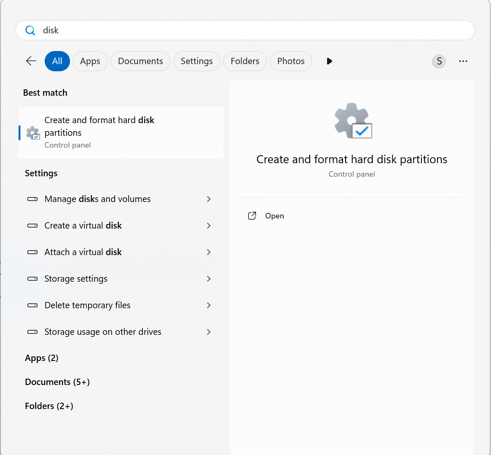
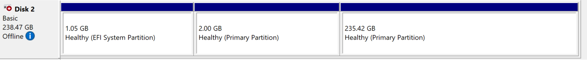
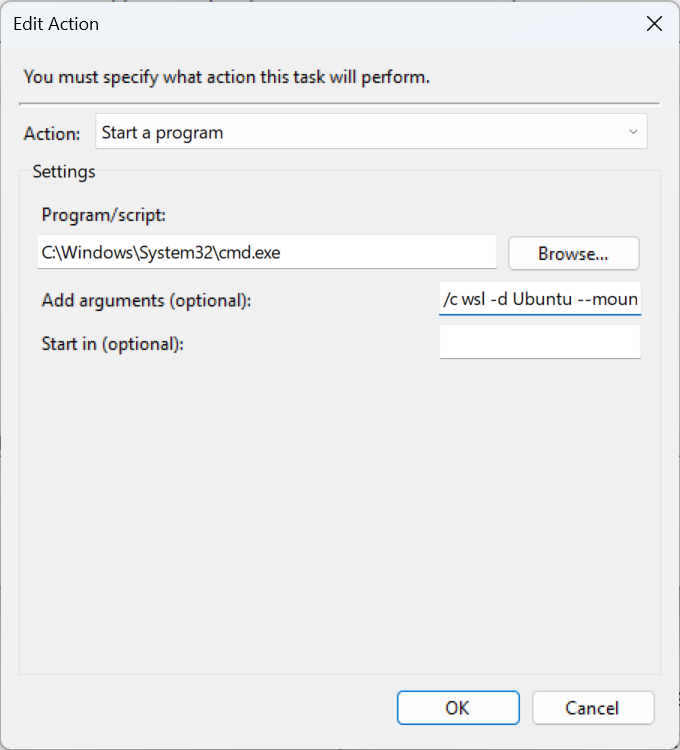

I recently setup a new gaming machine with Windows 11. I have been away from Windows for almost 15 years, except for compiling and running apps here and there. It's not bad after you run a [debloater](https://github.com/Raphire/Win11Debloat). 

Ok, so now I dual boot with Ubuntu 24.04 LTS. I remote into it from my macbook for development. I also develop on Windows when I am using the PC (which is most of the time these days).

There is a problem now, I am not disciplined enough to always have all the repos checked in, all the time. If I start doing something on the mac and later on want to continue it on the PC, I need to setup a shared workspace. Thankfully, WSL2 can mount linux drives, including btrfs!

## Setting up a Shared Workspace

### Mark the disk offline
Mark the linux drive offline in the disk management tool so we can stop Windows from accessing it. 



Inside the tool, right click the disk and mark it offline.




### Attach the drive at login in Windows
Figure out the disk to attach.
Open powershell and run:
```bat
 wmic diskdrive list brief
```
Check the DeviceID column for the name.

Search for task scheduler and open it.
Create a new basic task. Name it something like "Mount Linux Drive". Set the trigger to "When I log on". Select "Run with highest privileges".
In the action, select "Start a program" and set the program/script to:
`C:\Windows\System32\cmd.exe`

Add arguments:
`/c wsl -d Ubuntu --mount \\.\PHYSICALDRIVE2 --bare`

Here replace `PHYSICALDRIVE2` with your device id and Ubuntu with your distro name.



### Mount the Linux Drive
Now mount the drive in WSL2. How to mount will depend on whether it's an LVM or not.

If it is an LVM, you need to install `lvm2` and create a systemd service to start it at boot, for example:
```
[Unit]
Description=Mount Ubuntu
[Service]
User=root
ExecStart=/bin/bash -lc 'vgchange -ay ubuntu-vg'

[Install]
WantedBy=multi-user.target
```

After that you will need to mount the contents of the lvm everytime you start WSL2. I could not get systemd to do that automatically.

```sh
sudo mount /dev/ubuntu-vg/ubuntu-lv /media/ubuntu
```

If it's not an LVM, you can just mount the drive directly. To find the UUID of the drive, run:
```sh
lsblk -fa
```
Then create a systemd service:
```
# /etc/systemd/system/mount-ubuntu.mount
[Unit]
Description=Mount Ubuntu

[Mount]
What=/dev/disk/by-uuid/your-uuid-here
Where=/mnt/ubuntu
Where=/media/ubuntu
Type=auto
Options=defaults

[Install]
WantedBy=multi-user.target
```
More on how to mount using systemd [here](https://manpages.debian.org/testing/systemd/systemd.mount.5.en.html).

**Note:** At the time of this writing WSL2 does not mount btrfs with `discard=async`. So make sure fstrim.timer is enabled and running when you boot into linux to make sure the filesystem is trimmed.

More details on trimming, including for external SSDs, see [here](https://wiki.archlinux.org/title/Solid_state_drive)

### All Set
Now you can start WSL2 and access your Linux drive from Windows.
And the same workspace is available in both environments!
I personally use VSCode for this.

Happy coding!